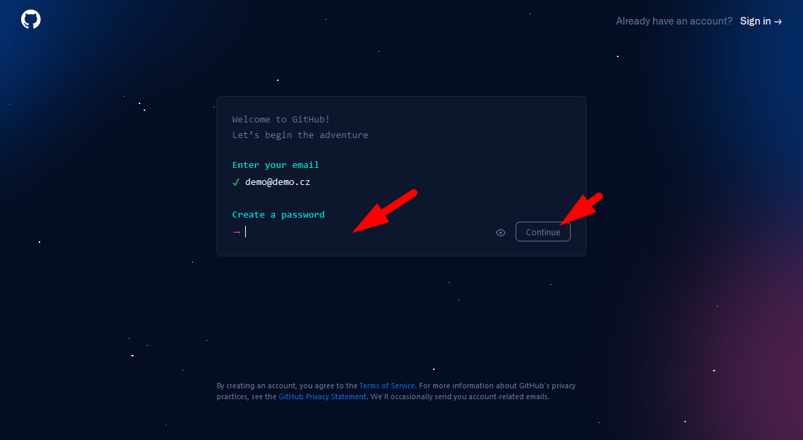
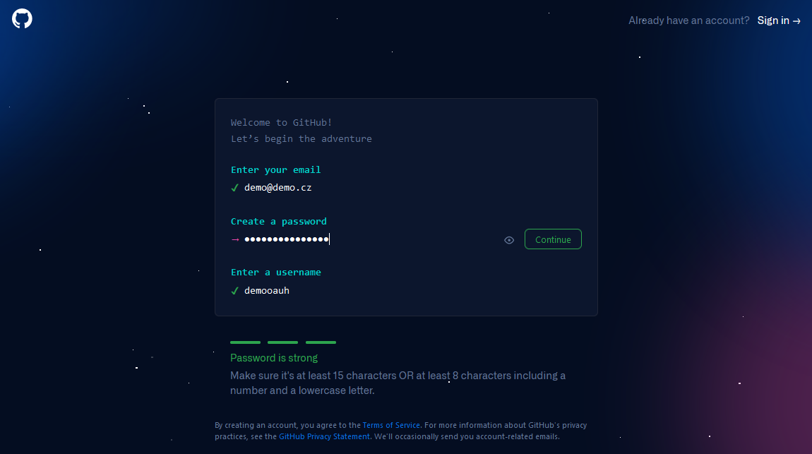
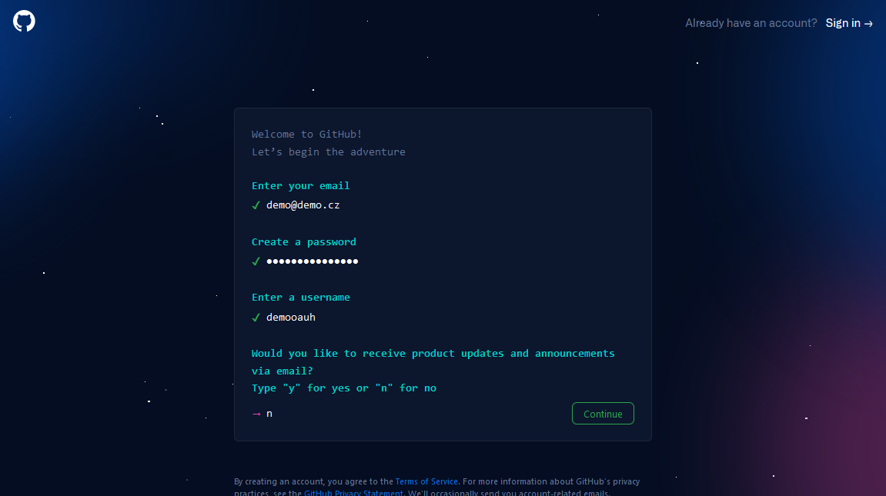
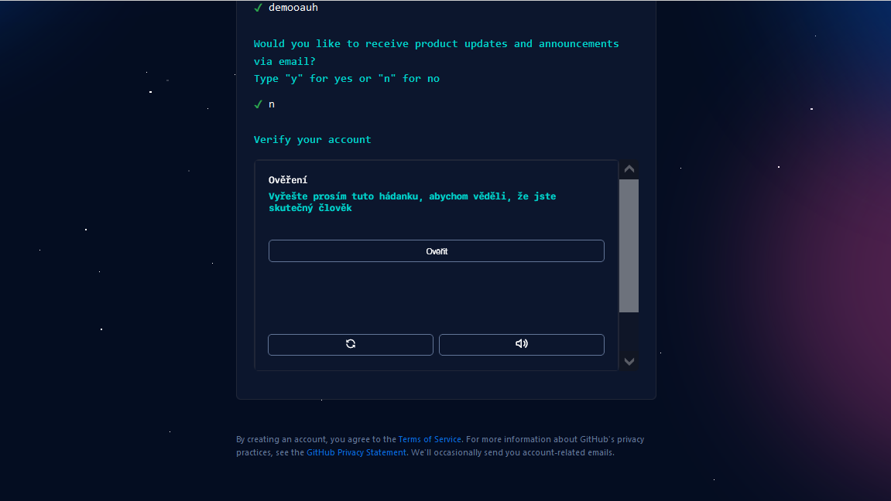
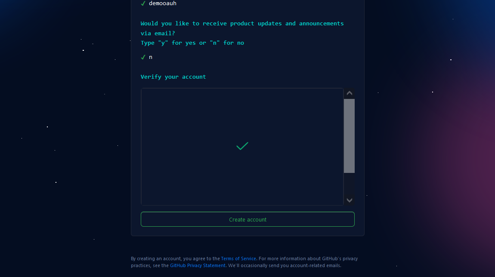
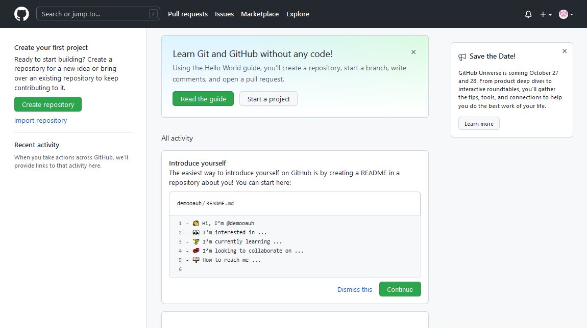
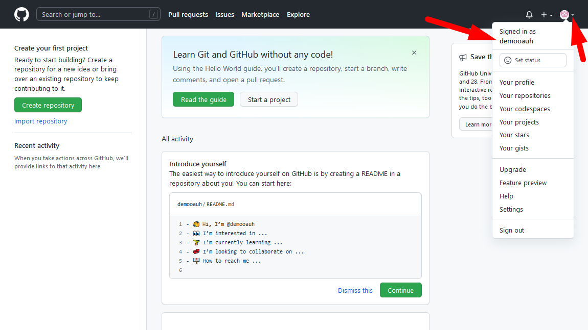

# Vytvoření účtu na GitHubu

Postup pro vytvoření účtu na GitHubu:

1. Jděte na [GitHub.com](https://github.com) a zadejte svůj e-mail: 
1. Potvrďte e-mail 
1. Zadej bezpečné heslo Heslo musí obsahovat alespoň písmena a&nbsp;číslice. 
1. Zadej název účtu 
Pod tímto účtem budeš na GitHubu vystupovat a&nbsp;bude zahrnut v&nbsp;adresách repozitářů. 
1.  
1.  
1.  
1. Opiš kód z&nbsp;e-mailu 
Případně vyplň další informace. Vytvoř si osobní účet, nikoli studentský! 
1. Jsi na GitHubu! 
1. Zde najdeš své uživatelské jméno: 

> Uživatelské jméno a heslo si zapamatuj!!!

Uživatelské jméno pošli vyučujícímu přes Teams, aby ti mohl nasdílet repozitář s&nbsp;učebnicemi!